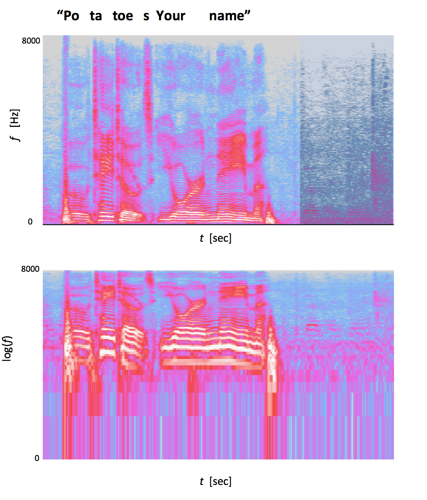
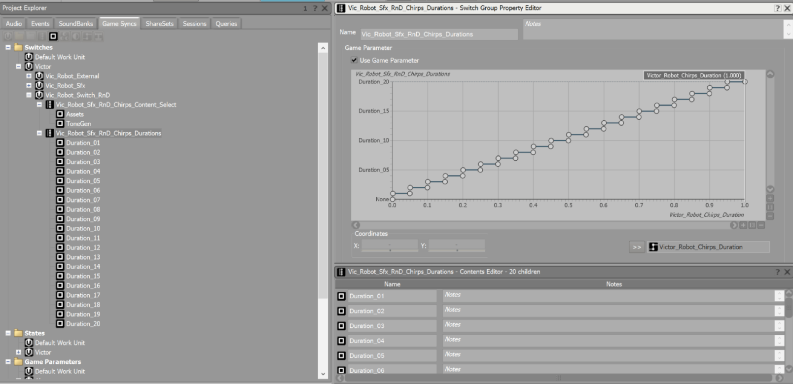
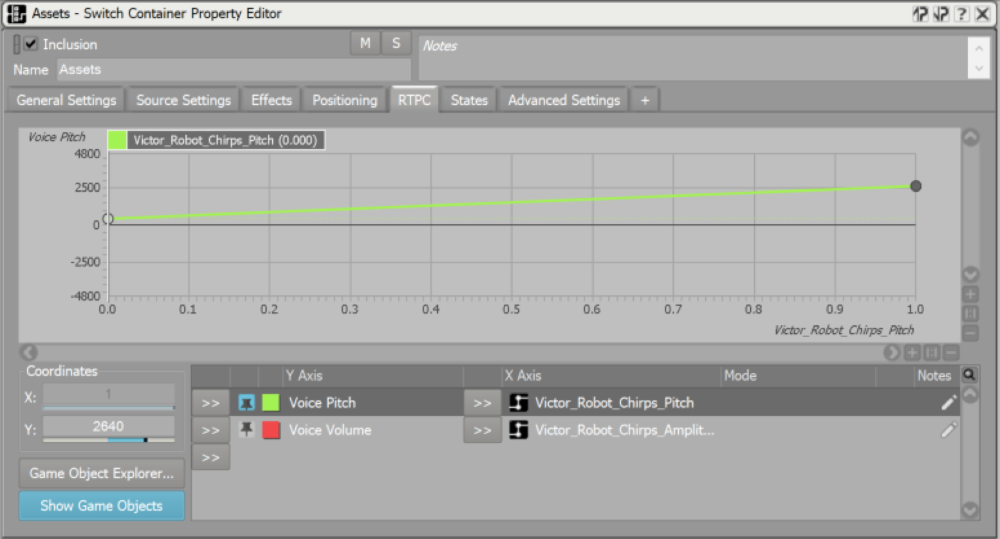
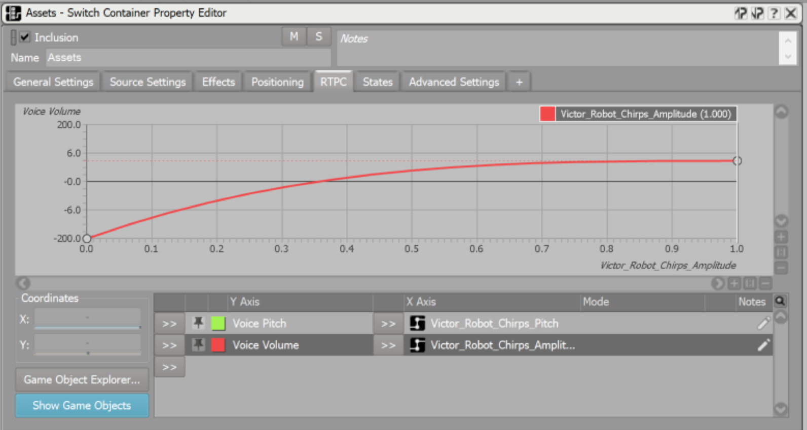

# Vector Chirps In! (RnD Spring 2019)
Created by Ross Anderson 

## Motivations and Summary

This project intends to fill a void in Vector's interactions with users and its environment. User testing would often capture users praising their robot with "good job" or greeting it like they would a pet, saying "hey buddy!"

In an ideal world, Vector would then respond back to those utterances in his own language of chirps, but in a way that conveys understanding. For example, if a user says "hey buddy," the robot could respond with "chirp chirp-chirp," mimicking the syllables, cadence, and intonation of the call. Or, if someone nearby is singing, Vector could sing back using his chirps. Finally, if a secondary nearby Vector chirps, the other could respond back.

To create this type of intentional response to a dynamic environment, we developed two approaches to analyze microphone input:

* an on-robot signal processing approach to identify syllables and intonation from microphone data; and
* a neural network in the cloud to interpret sounds.

Once having analyzed the input, we respond using:

* a sequencer to play back multiple chirps with a given duration, pitch, and volume;
* audio banks for a language of chirps that can mimic environmental sounds; and
* animations to match the cadence of the robot response.

Finally, something that was not shown during the RnD fair is a protocol for two robots to detect one another via BLE advertisements and start chirping in a preprogrammed pattern. As an example, they detect each other an automatically start singing a duet of "Mr. Roboto" by Styx.

## Date
30 Jan 2018

## Team
* Andrew Bertolini
* Lorenzo Riano
* Ross Anderson
* Selen Atiker

## Syllable detection
This approach analyzed microphone input in order to identify and segment individual syllables, and subsequently compute the dominant pitch, intonation (rise or fall in pitch), and volume. It runs fully on the robot. 

The starting point for syllable segmentation was an algorithm proposed for analyzing bird calls, described in [this paper](http://ieeexplore.ieee.org/stamp/stamp.jsp?tp=&arnumber=1200027&isnumber=26996)

   Harma, A.; , "Automatic identification of bird species based on sinusoidal modeling of syllables," 
   Acoustics, Speech, and Signal Processing, 2003. Proceedings. (ICASSP '03). 
   2003 IEEE International Conference on , vol.5, no., pp. V- 545-8 vol.5, 6-10 April 2003

which is available as a [Matlab script](https://www.mathworks.com/matlabcentral/fileexchange/29261-harma-syllable-segmentation). It computes the PSD of an input signal of fixed duration, and then finds the time point with globally maximum power. From that point, it searches forward and backward in time until the power drops below a given threshold. Those extents in time indicate the beginning and end of the syllable. Next, excluding that syllable's time window, it searches again for the time point with maximum power, and so on. Once the remaining PSD has a maximum power below another threshold, the algorithm completes. 

This script was translated into C++ and integrated into the anim process. We used an FFT window size of 512 samples, zero padded to length 1024, and overlapped by 128 samples with a Hamming window. It works well for clearly-separated syllables, but had trouble segmenting syllables without a stop consonant. The following figure shows the spectrogram for the (contrived) utterance "potatoes your name." The P, T, and T in potatoes are all stop consonants, and the beginning of those syllables corresponds to visible decreases in the power of the audio. However, "your name" does not have a stop consonant between "your" and "name," and is instead voiced throughout. Consequently, in the lowest frequencies, which have greater intensity, there is no separation between syllables. Hence, in this example, only four syllables were identified, "po," "ta", "toes," and "yourname." 

To improve this, future work could consider the changes in higher frequencies. In the below example, there is a reduction in power of higher frequencies between "your" and "name." Also, sibilants like the "s" in "potatoes" show an increase in the power of higher frequencies, which could be used to inform segmentation. 



Once syllables were segmented, our goal was to determine the starting and ending pitch of each syllable, so that the sequencer could dynamically adjust pitch for the duration of the syllable. As seen in the above figure, especially in log scale, the spectrogram of a human voice is quite complex. Due to filtering provided by the vocal tract, there are multiple harmonics that change in pitch. These issues are further amplified by the filtering applied by microphones and signal essence, causing some harmonics to "bleed" into one another. Our approach is ad-hoc, and mostly trained to Ross's voice.

Since male voices typically range between 65 to 260 Hertz, while females speak in the 100 to 525 Hz range, we first applied a band pass filter filter between 50 Hz and 300 Hz. For each syllable, starting with the time point with maximum power, we searched forward and backward until the power dropped off by a given threshold – a lesser dropoff than when segmenting syllables – so as to isolate the region of the syllable that contained a maximum intensity, and disregard small inflections at the start and end of syllables. If the time point of the start of this region is a, the peak is at b, and the end is at c, the starting pitch was computed from the region [a, min(a+5,b], and the ending pitch was computing from the region [b, max(c-5, b)]. In each region, we used the average of the maximum intensity frequencies at each time point. The sequencer is then given both the starting pitch of the syllable and its ending pitch. The average intensity over the duration of the syllable was used as the syllable's volume.

## Sound interpretation using neural networks

Using neural networks, arbitrary sounds can be translated into Vector's chirps. These include not only human voice, but also music, TV sounds and general ambient noise. The result would be a robot that is responsive to the environment, pays attention and mimics the sounds/voices he hears.

Sound interpretation requires that the neural network produces a sequence of notes (pitches) with the corresponding duration and volume. To this aim we used the neural network model [Onset and Frames](https://magenta.tensorflow.org/onsets-frames) developed at Google. For the R&D project the network ran on a remote EC2 instance.

During the demo an arbitrary audio is recorded on a regular MacBook. The audio is then processed and sent over to the EC2 instance running Onset and Frames. The result is then sent back to the laptop, converted to a sequence of pitches and durations and finally sent to Vector for reproduction (either using tones or chirps).

The results vary. Onset and Frames is trained on clean piano data and it therefore struggles to reproduce other sounds, especially when captured in a noisy environment. If a similar approach were to be used in production, we'll need to collect data and train a new network from scratch. Nonetheless this demo shows the potential of using advanced machine learning techniques for audio processing to create an engaging Vector.

## Robot response
### Sequencer
For either method of analysis of the microphone input, the computed list of chirps, comprised of a start and end time, starting pitch, ending pitch, and volume, are provided to a sequencer. This sequencer is in many ways similar to a MIDI sequencer. A thread in the anim process sends playback events and RTPC parameters to wwise.

We created two types of sound banks to demonstrate the chirps. One produces a sine wave of a given frequency, which is useful for understanding the effectiveness of our microphone input analyzers. The other banks consist of a set of recorded assets (Andy performing Solfège) that are passed through a "dehumanizer" plugin and shifted to the desired pitch. This approach illustrates what could potentially be done should we create a much larger set of "chirp" assets. When testing the branch, it is demonstrative to hear both types of sound banks.

Since the sound banks are limited to pitches between 440 Hz and 1760 Hz (two octaves), chirp sequences are evaluated to determine the best octave at which to play each chirp. This is done by computing the number of outliers outside of the [440,1760] range when transposing the input pitch by a given number of octaves. With human voices as the input, for instance, the pitch is often scaled by 2-3 octaves so that the entire sequence is contained in the [440,1760] interval.

### Sound banks

The Duration Selection system utilizes a RTPC (Real Time Parameter) to select buckets of sound effects and tones based on their overall duration. The RTPC is fed a value of [0-1] and selects the appropriate bucket in real-time. Each bucket spans a playback range of 50ms starting from [0-49] and capping out at [950-1000]:



The Pitch system is also driven by a RTPC. This specific parameter receives a number between [0-1] and translates it to a frequency range of 440Hz - 1760Hz(for tones) and 440Hz - 2640Hz(for raw assets). The original value is determined by Ross’ pitch detection system and is fed over alongside the Play event for each syllable.



The Amplitude system is a simple system that adjusts the overall sound level of both the raw assets and the tone generator. This system also utilizes a RTPC that receives data from the robot sequencer.




The Content Selection system is a simple toggle between a sine wave tone generator and raw recorded assets. This can be manually toggled from a WebViz cvar.


### Animations

Selen created get-in, looping, and get-out animations in which Vector acted out the responding chirps. Animations were grouped by the number of syllables (1, 2, or 3), and which syllable was stressed (1, [1 or 2], [1, 2, or 3], respectively). The sequencer grouped each chirp response into sets of 1, 2, or 3 syllables. For each set, the amplitude of each syllable was used to select the animation. For example, "quiet" would select an animation with two syllables, where the first syllable is emphasized, while "potatoes" would select an animation for three syllables, in which the second syllable is emphasized.

## BLE consensus for scripted Vector duets

A common user request is for two Vectors to interact with one another. Having two robots begin a scripted "conversation" with one another in their chirping language would require that one Vector can detect another, and that they can agree on a protocol for a realistic conversation and a synchronized start time for that conversation.

Currently we lack the ability to detect another Vector. It seems reasonable that the neural network models for hand and person detection could be extended to identify Vectors from camera images. We could also explore detecting Vector's chirps from the microphone stream.

A simpler approach is to identify a nearby Vector from its BLE advertisement. While production robots filter nearby BLE advertisements for cubes, it's straightforward to instead scan for other Vectors. Once a nearby Vector is found, the BLE advertisement can further be exploited to help the robots agree on a chirping conversation. (In a 2018 OverDrive RnD project, each device emitted its local WiFi IP address in its BLE advertisement, and after detecting a device via BLE, further communication used WiFi. However, with Vector, the web service is disabled for production robots. While we could use WiFi for this demo, we only used BLE to better understand our constraints should we decide to implement this in the product for real.)

The format for the manufacturer data of a BLE advertisement allows us to pack up to 24 bytes of additional data, beyond the required company identifier. The first of these bytes currently signifies whether or not the robot is pairing (0 or 'p'), and that was left intact to avoid bricking the robot. Despite a theoretical remainder of 23 bytes, it seems that one robot will stop noticing a change in another's advertisement if we supply more than 5 bytes. I did not investigate this fully, so it's likely that we could eventually use more than 5 bytes. But for the purposes of this RnD project, 5 bytes of manufacturer data are dynamically adjusted, creating a simple communication protocol between robots.

The goal is for two robots to agree on a time to start a scripted "conversation" by dynamically adjusting the available 5 byte payload. Many clock synchronization protocols for wireless sensor networks guarantee bounded differences in clocks in the presence of bounded communication delays. In testing performed outside of the office, a robot can detect a change in another robot's advertisement in less than one second. This suggests that a great deal of literature related to consensus in wireless sensor networks could apply to our robots in users' households. In the office, however, an advertisement change may not be detected for many seconds, or at all, due to the large population of robots. Fortunately, Vectors already sync their clocks with Network Time Protocol (NTP) servers. The protocol developed herein relies on two robots having a shared clock, and they must simply reach a consensus on the time -- relative to their synced clocks -- for a conversation to begin.

### The protocol
This is a naive protocol for agreement on a specific time, in milliseconds since epoch, at which two robots should begin their chirping duet. It's only applicable to two robots, but could be extended to multiple robots. It also assumes that two robots synched their clocks to NTP at different times. (Usually, this constraint is satisfied if two robots booted at different times, but network issues could complicate things.) The following protocol is not meant to describe the best approach, but it was a fast way to agree on an epoch time in milliseconds in 5 bytes.

1) When a robot syncs its clock to NTP servers, it records the number of seconds since midnight relative to std::chrono::system_clock. These seconds are packed into the first two bytes of the extra BLE manufacturer data payload.

2) When a robot A detects a robot B with two extra bytes, it compares the other robot's NTP clock sync time to its own, assuming its own clock has been synced. If robot A synced its clock before robot B, it assumes the role of 'Host.' Otherwise, it becomes the 'Client.'

3) A 'Host' robot then decides on a start time, in milliseconds since epoch. Here, we choose a time about 5 seconds later, to give time for BLE advertisements to be received. Since the milliseconds since epoch must be packed into the left over 3 bytes, the number of milliseconds since midnight for this time is computed. That would still overflow 3 bytes, so the millisecond since midnight is advertised modulo 0xFFFFFF.

4) A 'Client' robot knows its a client because its NTP sync time is later than a detected neighbor's sync time. A client robot will then detect the additional 3 bytes in the host's payload, signifying the milliseconds since midnight, mod 0xFFFFFF. The client will find the first time relative to std::chrono::system_clock::now(), in seconds since midnight with respect to increments of 0xFFFFFF, that matches the received number of milliseconds until midnight. The client then adds a single byte to its advertisement to signify agreement with the host's proposition, and begins the conversation sequence.

5) When the host receives the agreement byte, it also begins the conversation sequence.

### Demo

Since we essentially made a MIDI sequencer, to demo this, we quickly created a Vector duet of "Mr. Roboto" by Styx, with each robot playing a different part. Their BLE consensus of the start time seemed exact, and there was no perceptible drift over the course of a 2 minute sequence. The song was manually but quickly transcribed from three primary instruments in publicly-available midi sequence into c++ code using macros like

```
  add( QUARTER, Bb1 ); // B flat one octave higher
  add( EIGHTH, Ab );   // A flat
  add( EIGHTH_REST );  // rest
```

Obviously, if we decided to ship these types of conversations between two robots, we'd use animations with audio keyframes instead of sheet music in C++, but this part was just for fun. Also, it would be ideal if each robot uses its microphone directionality data to turn towards the input of its robot pair.

## Running the demo

Check out the victor branch chirpRndProject. When running on a robot, your controls are found under the anim console vars heading "Chirps." To enable animations, toggle the console var PlayAnims. You can switch between the output sine wave and Andy's Solfège using the console dropdown SwitchType.  To hear test patterns, such as "shave and a haircut," for each response type, try the console funcs under the subheading Demo.

### Human syllable detection

Change the console var ChirpMode to HumanSyllables. The robot will record 3 seconds of audio, and either respond with a sequence of chirps, or cycle back to recording again. When the robot is recording, the backpack lights illuminate in blue (although it is not streaming to the cloud). To test the syllable detection feature, wait until the lights turn on, place your mouth close to the microphones, and then say "something something something something something." You should hear a sequence of tones or assets that roughly match the spoken syllables, including their intonation and volume.

### Cloud neural network

Change the console var ChirpMode to OffboardInput, and then use the scripts located here. For this, you should speak into your laptop's microphone, not the robot's microphone.

### Mr. Roboto duet

Change the value of the variable kConsensusProtocol in daemon.cpp from false to true. Build and deploy to two robots. Start one robot a few seconds after the other. Wait around 15 seconds, and they will start singing, first with a test pattern, and then Mr. Roboto.

## Conclusions
Even when the synthesized chirps do not exactly match – or show no semblance whatsoever to – the input, users seem to enjoy having the robot respond when spoken to. Some users would concoct an interpretation to the robot's response, or even assume a rise or fall in the robot's intonation was an indication of emotion.

We think that an even simpler approach could suffice to fill the goals outlined at the beginning of this page. For example, the robot could emit a random sequence of chirps if a user is looking at the robot, and the voice activity detector (VAD) is active.

Currently, our VAD is not accurate enough to distinguishing between voices and noise (especially motor noise), so learnings from syllable detection might also help identify whether the microphone input truly contains speech.

This project also demonstrates the potential of using advanced machine learning techniques for audio processing.


